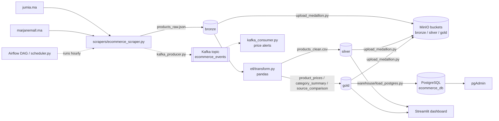

# E-commerce market intelligence pipeline

Batch and streaming data pipeline that collects product listings from two
Moroccan e-commerce sites (Jumia and MarjaneMall), cleans and aggregates them
with pandas following the medallion pattern (bronze / silver / gold), stores
the layers in a MinIO data lake, loads the gold layer into a PostgreSQL
warehouse and exposes the results in a Streamlit dashboard. Kafka is used for
a small real-time price alert stream, and an Airflow DAG (or a plain Python
scheduler) runs the batch pipeline every hour.

Course project for the data architecture module (computer engineering). The
original French report is in [docs/Projet_architecture_de_donnee.pdf](docs/Projet_architecture_de_donnee.pdf).

## What it does

1. **Scrape** product name, category, current price, original price and URL
   from category pages of jumia.ma and marjanemall.ma (`scrapers/ecommerce_scraper.py`).
2. **Transform** with pandas (`etl/transform.py`): clean the raw rows into a
   silver table and compute gold aggregates (price statistics per product,
   per category, and a per-source price comparison).
3. **Store** each layer in its own MinIO bucket (`upload_medallion.py`),
   with a `dt=YYYY-MM-DD` partition for history and a `latest` copy.
4. **Load** the gold layer into PostgreSQL (`warehouse/load_postgres.py`):
   `products`, daily `price_history` and `category_summary` tables, upserted
   so the pipeline can be re-run safely.
5. **Visualise** the silver and gold layers in Streamlit (`dashboard/app.py`).
6. **Stream** (optional): `kafka_producer.py` sends product events to a Kafka
   topic and `kafka_consumer.py` prints price and promotion alerts.

## Architecture



## Medallion layers

| Layer  | File (local `data/` and MinIO bucket) | Content |
|--------|----------------------------------------|---------|
| Bronze | `bronze/products_raw.json` | Raw scraped rows exactly as collected: `product_id, name, category, current_price, original_price, currency, source, url, stock_status, timestamp`. |
| Silver | `silver/products_clean.csv` | One row per product and source. Strings trimmed, source names standardised (`jumia`, `Marjane Mall` -> `Jumia`, `MarjaneMall`), prices parsed to floats (`"4 099,00 DH"` -> `4099.0`), rows without a name or a positive price dropped, duplicates removed (latest scrape kept), `discount_percent`, `is_promotion`, `scraped_at`, `processed_at` and a deterministic `product_key` (hash of name + category) added. |
| Gold   | `gold/product_prices.csv` | Per product and source: min / avg / max price, number of offers, average discount, URL, snapshot date. |
|        | `gold/category_summary.csv` | Per category: number of products, offers and sources, min / avg / max price, average discount, number of promotions. |
|        | `gold/source_comparison.csv` | Per product: price on each source (`price_jumia`, `price_marjanemall`), best price, cheapest source, absolute and relative price gap. |

The warehouse schema is in [sql/schema.sql](sql/schema.sql):
`products (product_key, source)`, `price_history (product_key, source, snapshot_date)`
and `category_summary (category, snapshot_date)`.

## How to run

Requirements: Docker with Docker Compose, Python 3.11.

```bash
pip install -r requirements.txt
cp .env.example .env          # optional, defaults match docker-compose.yml
docker compose up -d          # MinIO, PostgreSQL, pgAdmin, Kafka, Airflow, dashboard
```

Run the batch pipeline (scrape -> transform -> MinIO -> PostgreSQL). Each step
is a separate script; the runner stops at the first non-zero exit code.

```bash
python run_full_pipeline.py             # live scraping
python run_full_pipeline.py --sample    # use the committed sample dataset (see below)
python run_full_pipeline.py --dashboard # also start the dashboard when done
```

Individual steps:

```bash
python scrapers/ecommerce_scraper.py [--sample]
python etl/transform.py
python upload_medallion.py
python warehouse/load_postgres.py
```

Dashboard: `python -m streamlit run dashboard/app.py` or the `dashboard`
container, then open <http://localhost:8501>.

Other interfaces:

| Service | URL | Credentials |
|---------|-----|-------------|
| Streamlit dashboard | http://localhost:8501 | - |
| MinIO console | http://localhost:9001 | admin / password |
| pgAdmin | http://localhost:5050 | admin@admin.com / admin (server: `postgres`, db `ecommerce_db`, user / password) |
| Airflow | http://localhost:8081 | printed in the airflow container log (`docker compose logs airflow`) |

Streaming demo (Kafka container must be up), in two terminals:

```bash
python kafka_consumer.py
python kafka_producer.py --sample --loop
```

Scheduling: the Airflow DAG `ecommerce_pipeline` (`airflow/dags/ecommerce_pipeline_dag.py`)
runs the four steps hourly inside the airflow container. Without Airflow,
`python scheduler.py [--sample] [--every 60]` does the same from the host.

### Offline quick check (no Docker)

Runs the scraping fallback and the silver / gold transformation only, then
starts the dashboard on the result:

```bash
python run_full_pipeline.py --sample --skip-minio --skip-postgres
python -m streamlit run dashboard/app.py
```

Or the transformation alone, writing to a separate directory:

```bash
python etl/transform.py --input data/sample_products.csv --output-dir data/out
```

Expected: 50 raw rows -> 47 silver offers (one duplicate, one row without
price and one without name removed) -> 47 product/source rows, 5 categories
and 28 compared products in gold.

## Sample data

`data/sample_products.csv` is a hand-written sample of 50 rows in the bronze
format (laptops, smartphones, appliances, TVs and fashion items with plausible
prices in DH, on both sources, including a few deliberately dirty rows). It is
**not** scraped data and its prices are not real market prices; it exists so
the transformation, the warehouse load and the dashboard can be exercised when
the sites block scraping. `--sample` on the scraper, the pipeline runner, the
Kafka producer and the scheduler switches to it. Nothing else in the pipeline
generates or duplicates data.

## Project structure

```
.
├── scrapers/ecommerce_scraper.py   Jumia + MarjaneMall scraper -> bronze (or --sample)
├── etl/transform.py                pandas: bronze -> silver -> gold
├── upload_medallion.py             local layers -> MinIO buckets
├── warehouse/load_postgres.py      gold -> PostgreSQL (SQLAlchemy + psycopg2, upserts)
├── sql/schema.sql                  warehouse tables
├── sql/init/                       creates the Airflow metadata database on first start
├── run_full_pipeline.py            runs the four steps in sequence (cross-platform)
├── scheduler.py                    hourly runner without Airflow
├── airflow/dags/ecommerce_pipeline_dag.py
├── kafka_producer.py / kafka_consumer.py
├── dashboard/app.py                Streamlit dashboard (+ Dockerfile, requirements.txt)
├── config.py                       paths and connection settings (env vars, .env)
├── data/sample_products.csv        committed sample; bronze/silver/gold outputs are git-ignored
├── docker-compose.yml              MinIO, PostgreSQL, pgAdmin, Zookeeper, Kafka, Airflow, dashboard
├── docs/Projet_architecture_de_donnee.pdf   course report (French)
└── requirements.txt
```

## Limitations

- Both sites answer HTTP 403 to plain `requests` calls from many networks
  (anti-bot protection). The scraper then returns no rows and exits with code
  2; use `--sample`. Selectors may also break when the sites change their HTML.
  The MarjaneMall selectors target the standard Magento 2 product grid and
  could not be verified against the live site during development.
- Transformation is pandas on a single machine. There is no Spark: the dataset
  is a few hundred rows per run, which does not justify a cluster.
- Products are matched across sources by exact name and category
  (`product_key`), so the same item listed with different titles is treated as
  two products.
- Kafka streaming only prints alerts; events are not persisted.
- The Airflow service runs in `standalone` mode with `LocalExecutor` and
  installs its Python dependencies at container start
  (`_PIP_ADDITIONAL_REQUIREMENTS`), which is fine locally but not a production
  setup. Kafka advertises `localhost:9092`, so the producer and consumer run
  from the host, not from inside the compose network.
- No tests beyond the offline check above.

## Résumé (français)

Pipeline de données de bout en bout : scraping de Jumia et MarjaneMall,
nettoyage et agrégation avec pandas selon l'architecture médaillon
(bronze / silver / gold), stockage des couches dans MinIO, chargement de la
couche gold dans PostgreSQL (tables `products`, `price_history`,
`category_summary`), tableau de bord Streamlit, flux Kafka pour les alertes
de prix et orchestration horaire avec Airflow ou `scheduler.py`. Un jeu de
données d'exemple (`data/sample_products.csv`, 50 lignes, non issu du
scraping) permet d'exécuter toute la chaîne lorsque les sites bloquent les
requêtes. Le rapport du projet est dans `docs/`.

## License

MIT, see [LICENSE](LICENSE).
